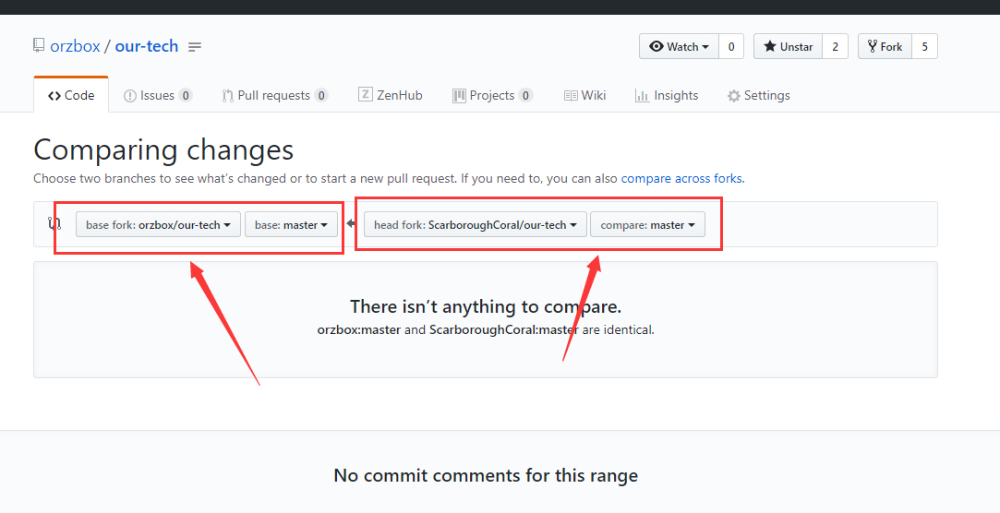
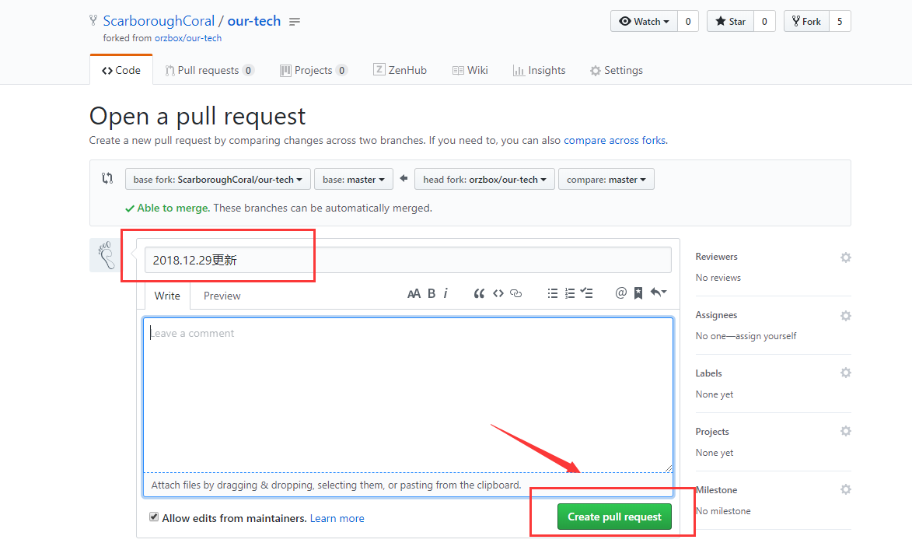

## 贡献方法

### Fork 仓库

Fork本仓库到你的仓库，这是参与贡献的前提，这也是 git 仓库的一大优势。

### 更新操作（反向pr，如果你的仓库是最新的那可以直接跳过这一步）

在提交文章前，最好能够更新一下，就是反向发起 `pull request` ，这样一定程度上保证了代码不会冲突。

以下是一个具体操作实例：

- 发起 pull request

- 选择反向pr，目标地址（左侧）选择你的仓库和更新分支，源地址（右侧）选择主仓库和分支

- 这个时候浏览器的 url 会改变，因为选择的是同一个仓库，所以只显示的分支pr，点击选择右上角仓库选择比较

- 选择目标地址（左侧）你的仓库和更新分支，源地址（右侧）选择主仓库和分支，这时候可以看到需要更新的内容，点击创建pr。如果没有内容那你可以跳过更新操作直接进行下一步。

- 填写pr名称，创建 pr，如果没有冲突就可以直接创建了。

- 合并更新到你的仓库

- 确认合并

- 合并成功

- 可以看到刚刚更新的操作了

### 提交文章

- **一定要在 `/articles/` 目录下创建你的文章**，命名采用**英文+“-”+数字**的方式，例如`virtual-memory1.md`。

- 然后发起 pr 请求，目标地址选择主仓库及其分支，源地址选择你的仓库和分支（默认情况下一般就是这样）。然后创建pr。

- 命名 pr 采用【文章分类建议】：【文章名称】的方式，创建pr请求。

- 等待审核（先采用这种方式，一般来说会在1个小时内）

### 审核成功后，你可以提交新的文章了！

### 文档排版

**非常重要！！！**

* 为了避免文件冲突！建议在线编辑文件，如果需要markdown的排版工作，建议复制到本地排版然后复制回页面提交。
* 排版问题，markdown中排版方式不同标志最好最后以**两个回车**结束。
