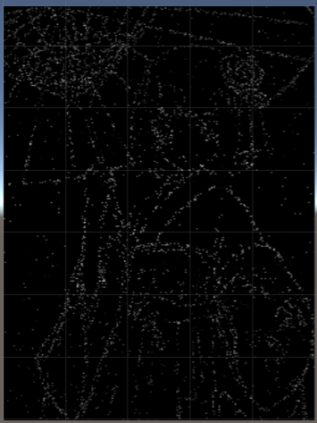
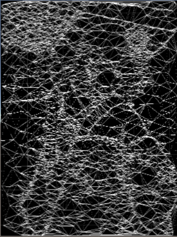

# 对图片进行低多边形渲染

> 作者: [DearSummer](https://github.com/DearSummer)

## 前言

在本个项目当中，尝试着对图片进行低多边形化，从而完成对一张图片进行低多边形的渲染。目标是达到能够制作比较好看的低多边形化的图片。

以下就是其中一种渲染的结果


## 概况

目前，实现对图片的低多边形渲染的方式有很多种，而这只是其中最简单的一种。不过，无论是什么样的低多边形渲染，实现的过程则是大同小异的。

将其实现的过程简单来说就是

    ·1 将图片的边缘区域找出来，形成一个线的集合
    ·2 根据图片的线的集合生成一个点集
    ·3 根据点集形成三角面
    ·4 上色

从步骤来说，这个实现确实比较简单

## 实现过程

关于本次低多边形的渲染的实现，我是参考了两篇论文
>[Artistic Low Poly rendering for image](https://link.springer.com/article/10.1007/s00371-015-1082-2#Fig4)  
[Low-Poly Style Image and Vedio Processing](https://ieeexplore.ieee.org/document/7314186)

第一篇论文主要讲述的是如何生成艺术感十足的低多边形图片，而第二篇则是一个比较简单的低多边形图片的实现方法，我在这主要参考的是第二篇的文章来实现的

实现工具为Unity

## 实现思路

第一步，找出图片的边缘的集合。找出一个图片的边缘的集合比较简单，简单的使用`Sobel算法`即可实现。

### Sobel算法

#### 原理
Sobel算法是一种边缘推导的算法，他可以计算出图片的边缘，当然，首先这个图片是灰度图，然后，计算每一个像素的x与y方向的灰度的偏导，当这个偏导十分大的时候，说明了这个图片的这个位置与其他位置的颜色的差别很大，那么我们就可以认为这是一个图片的边缘像素

#### 实现
首先是灰度图
```
return 
(float) (0.29899999499321 * (double) this.r + 
         0.587000012397766 * (double) this.g + 
         57.0 / 500.0 * (double) this.b);
```
灰度图就是一个对一个图片的RGB值进行一个按比例的取值，之后就可以计算出一个图片的灰度值了


得到灰度图之后就可以对其进行Sobel的算子的运算了
```
        1 0 -1          1  2  1
 f(x) = 2 0 -2  f(y) =  0  0  0
        1 0 -1         -1 -2 -1
```
他的使用方式就是每一个像素点乘上相应的位置然后加起来，最后计算出当前像素点当前方向偏分值
```

//这里使用的是一种改进的Sobel算子，但是计算过程是一样的
var gx =
 -3 * GetGray(i - 1, j - 1) + 0 * GetGray(i, j - 1) + 3 * GetGray(i + 1, j - 1) +
-10 * GetGray(i - 1, j) + 0 * GetGray(i, j) + 10 * GetGray(i + 1, j) +
 -3 * GetGray(i - 1, j + 1) + 0 * GetGray(i, j + 1) + 3 * GetGray(i + 1, j + 1);

var gy =
 3 * GetGray(i - 1, j - 1) + 10 * GetGray(i, j - 1) + 3 * GetGray(i + 1, j - 1) +
0 * GetGray(i - 1, j) + 0 * GetGray(i, j) + 0 * GetGray(i + 1, j) +
-3 * GetGray(i - 1, j + 1) + -10 * GetGray(i, j + 1) + -3 * GetGray(i + 1, j + 1);

//最终的微分值
var g = Mathf.Sqrt(gx * gx + gy * gy);

//然后根据这个值是否超过了一定的大小从而区分出是否为边缘
temp.SetPixel(i, j, g > threshold ? new Color(1, 1, 1) : new Color(0, 0, 0));

```


### 选择点集
第二步，就是为这些边缘选择点集。由于边缘过于多，就会导致点的数量十分的庞大，那么计算起来也会十分的复杂，因此就需要简化边缘了。同时，由于直接使用边缘会导致点集过于集中，最后生成三角面会包含大量的锐角三角形，那么就不会那么的美观了，因此，对点集的优化是必要的。

选择点集的方法有很多种，`Artistic Low Poly rendering for image`当中，使用的是`Douglas–Peucker algorithm`算法，一种将曲边简化为直线边的方法，将大量的曲线进行了简化，于是留下了较少的边。当然，他对这个算法进行了一下改进，将较长的边划分为较短的边再开始合成，从而防止一下子合成了太多的点

而`Low-Poly Style Image and Vedio Processing`当中则是使用随机的方式，分别从边缘以及非边缘的地方随机取点，设捕获点的因子为`a`，总边数为`N`,选取的变数为`n_select`,在特征边上的点为`n_edge`，那么，在边缘当中的捕获几率则为`p = (a * n_select / n_edge)`,边缘外的捕获几率则为`p = ((1 - a) * n_select / N - n_edge)`

使用其中一种或多种方法则可以将边过滤



### 生成三角面
生成的三角面为`Delaunay三角面`，其特点就是三角面的内接圆当中没有第四个点。他的算法公式有很多，优化格式的种种也有很多，这里就给出我参考的一种算法
>[Triangulate](http://paulbourke.net/papers/triangulate/)

里面的解释也比较详细，这里就贴出他的伪码
```
subroutine triangulate
input : vertex list
output : triangle list
   initialize the triangle list
   determine the supertriangle
   add supertriangle vertices to the end of the vertex list
   add the supertriangle to the triangle list
   for each sample point in the vertex list
      initialize the edge buffer
      for each triangle currently in the triangle list
         calculate the triangle circumcircle center and radius
         if the point lies in the triangle circumcircle then
            add the three triangle edges to the edge buffer
            remove the triangle from the triangle list
         endif
      endfor
      delete all doubly specified edges from the edge buffer
         this leaves the edges of the enclosing polygon only
      add to the triangle list all triangles formed between the point 
         and the edges of the enclosing polygon
   endfor
   remove any triangles from the triangle list that use the supertriangle vertices
   remove the supertriangle vertices from the vertex list
end
```

他的计算的思路也比较简单，由于Delaunay三角面的特点是没有第四个点在同一个内接圆当中，那么，他首先先生成一个巨大的三角形，包含了所有的点，然后，对点集里面的每一个点都进行遍历，首先是检查目前存在的所有的已经组合的三角形里是不是没有第四个点，若没有，则这个三角形合格的，否则将这个三角形拆成三个边，将这些边与下一个点结合组成一些新的三角形，以此类推，那么当遍历完成之后，剩下的三角形的集合就是都是符合Delaunay三角面的了。然后，再将这些三角形当中与一开始制作的大三角形相关的三角面去掉，剩下的就是一个符合标准的Delaunay三角面了。



### 上色
当我们生成了大量的三角面之后，当然要我们的图片着色啊。

由于我们已经有了三角面那么，我们就可以根据三角面进行上色了时间复杂度当然也就是O(N)啦，因此上色是一件很快的事情，不过，上什么色就是一个问题了。

在两篇论文当中使用了两种不同的上色方式，在第一篇当中，使用的是对三角面内的所有点的40%-60%的颜色取平均，而第二篇论文则是取三角形的三个顶点的颜色，这两种方法互有优劣啦，取平均的话颜色的过渡会十分的好看，但是，这样，若想要得出比较漂亮的低多边形图案就要很依靠特征边的选取了（因此，在第一篇论文当中使用了`cheng 2013 efficient`的算法计算出图片的特征图，从而选取了对人们来说感觉最强烈的地方，用比较多的面构造，而背景则用比较少的面构造，从而营造出了艺术的感觉），而第二篇论文的着色手段会使得图片的色彩对比比较强烈，看上去就很有感觉，因此怎么着色就看各人喜好了。
