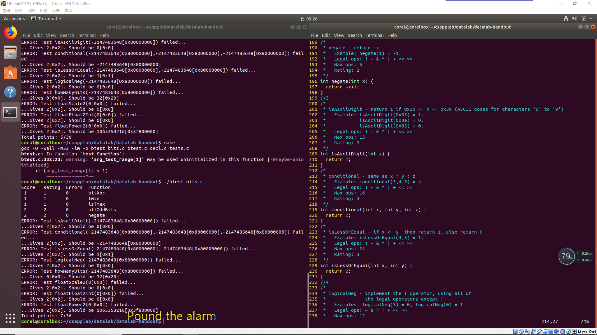

# CSAPP 实验记录

> 作者：[ScarboroughCoral](https://github.com/ScarboroughCoral)

快速开始请访问 `CSAPP` [Lab](http://csapp.cs.cmu.edu/3e/labs.html) 官网，本次实验记录是基于 CSAPP 3.0，实验日期始于：`2019-1-5`


- [Data Lab（进行中）](#Data-Lab)

> 这个文章会不断更新。


***实验打算采用以下框架来记录***

- 题目列表
- 实验题目题解
  - 题解代码
  - 题目思考
- 关于本次实验的思考


> 当真正开始做实验的时候，才发现自己有多菜。





## Data Lab

开始做 `CSAPP` 的实验了，这次是第一次实验，内容是关于计算机信息的表示，主要是位操作、整数题和浮点数相关的题。


### 题目列表

|         名称         |            描述             | 难度 | 指令数目 |
| :------------------: | :-------------------------: | :--: | :------: |
|     bitXor(x,y)      |    只使用`~`和`&`实现`^`    |  1   |    14    |
|        tmin()        |        返回最小补码         |  1   |    4     |
|       isTmax()       |    判断是否是补码最大值     |  1   |    10    |
|    allOddBits(x)     | 判断补码所有奇数位是否都是1 |  2   |    12    |
|      negate(x)       |  不使用负号 `-` 实现 `-x`   |  2   |    5     |
|   isAsciiDigit(x)    | 判断 `x` 是否是 `ASCII` 码  |  3   |    15    |
| conditional(x, y, z) |  类似于 C 语言中的 `x?y:z`  |  3   |    16    |
|  isLessOrEqual(x,y)  |           `x<=y`            |  3   |    24    |
|    logicalNeg(x)     | 计算 `!x` 而不用 `!` 运算符 |  4   |    12    |
|    howManyBits(x)    | 计算表达 `x` 所需的最少位数 |  4   |    90    |
|   floatScale2(uf)    |        计算 `2.0*uf`        |  4   |    30    |
|  floatFloat2Int(uf)  |       计算 `(int) f`        |  4   |    30    |
|    floatPower2(x)    |        计算 $2.0^x$         |  4   |    30    |

### 题解

#### bitXor(x,y)

> 只使用两种位运算实现异或操作。这个算是一个比较简单的问题了，难度系数1。学数电和离散二布尔代数的时候了解过。

- 代码

  ```c
  /* 
   * bitXor - x^y using only ~ and & 
   *   Example: bitXor(4, 5) = 1
   *   Legal ops: ~ &
   *   Max ops: 14
   *   Rating: 1
   */
  int bitXor(int x, int y) {
    return ~(~x&~y)&~(x&y);
  }
  ```


- 思路

  根据布尔代数，可以通过 `~` 和 `&` ，即非和与操作实现异或操作。所谓异或就是当参与运算的两个二进制数不同时结果才为1，其他情况为0。`C` 语言中的位操作对基本类型变量进行运算就是对类型中的每一位进行位操作。所以结果可以使用非和与计算**不是同时为0情况和不是同时为1的情况进行位与**，即`~(~x&~y)&~(x&y)` 。

#### tmin()

> 使用位运算获取对2补码的最小 `int` 值。这个题目也是比较简单。

- 代码

  ```c
  /* 
   * tmin - return minimum two's complement integer 
   *   Legal ops: ! ~ & ^ | + << >>
   *   Max ops: 4
   *   Rating: 1
   */
  int tmin(void) {
    return 0x1<<31;
  }
  ```

- 思路

  C 语言中 `int` 类型是32位，即4字节数。**补码最小值就是符号位为1，其余全为0。**所以只需要得到这个值就行了，我采用的是对数值 `0x1` 进行移位运算，得到结果。

#### isTmax()

> 通过位运算计算是否是补码最大值。这个题想了好久，最终参考了别人的代码。

- 代码

  ```c
  /*
   * isTmax - returns 1 if x is the maximum, two's complement number,
   *     and 0 otherwise 
   *   Legal ops: ! ~ & ^ | +
   *   Max ops: 10
   *   Rating: 1
   */
  int isTmax(int x) {
    int i = x+1;//Tmin,1000...
    x=x+i;//-1,1111...
    x=~x;//0,0000...
    i=!i;//exclude x=0xffff...
    x=x+i;//exclude x=0xffff...
    return !x;
  }
  ```

- 思路

  做这个题目的前提就是必须知道补码最大值是多少，这当然是针对 `int` 类型来说的，最大值当然是符号位为0，其余全是1，这是补码规则，不明其意则 Google。在此说一下个人理解，最终返回值为 0 或 1，要想判断给定数 `x` 是不是补码最大值（`0x0111,1111,1111,1111`），则需要将给定值 `x` 向全 0 值转换判断，因为非0布尔值就是1，不管你是1还是2。根据我标注的代码注释理解，如果 `x` 是最大值，将其转换为全0有很多方法，不过最终要排除转换过程中其他的数值，比如本例子中需要排除`0xffffffffffffffff` 的情况：将 x 加1的值再和 x 相加，得到了全1（函数第二行），然后取反得到全0，**因为补码-1也有这个特点**，所以要排除，假设 x 是 -1，则 +1 后为全 0，否则不为全 0，函数4-5行则是排除这种情况。

### 关于本次实验的思考

> 题目暂未完成
