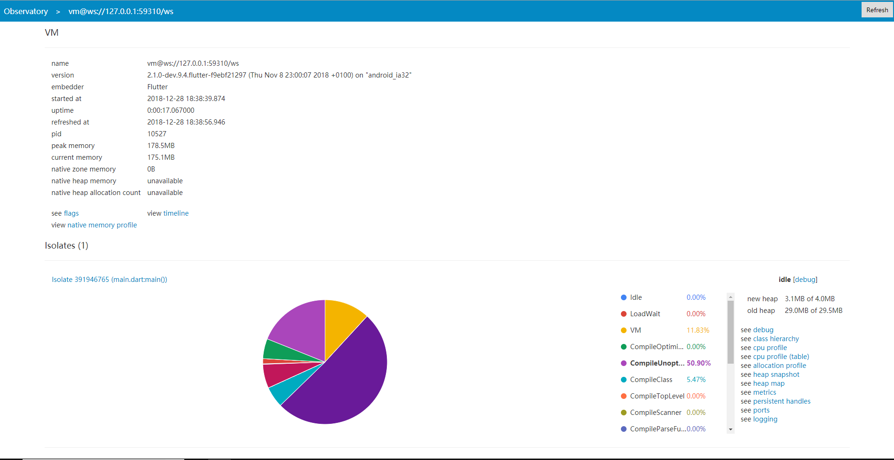

# Flutter 推荐
> 作者：[ScarboroughCoral](https://github.com/ScarboroughCoral)

## 关于入门 Flutter

Flutter 是一个由谷歌开发的开源移动应用软件开发工具包，用于为 `Android` 和 `iOS` 跨平台开发应用，同时也将是 `Google Fuchsia`（最近在关注的操作系统，前几天好像 UI 引擎彻底废旧立新了） 下开发应用的主要工具。基于 `Dart` 语言。

入门很简单！和 Web 前端开发相似，个人感觉是因为 dart 语法和 js 有相似之处，这可能是大前端的趋势吧。从没有看过 dart 语法的你，也能很快入门！

## 优点

- 感觉写起来很快，之前写过一些原生的 app，用着是比较麻烦的，可能有助于深入理解原理。不过作为入门前端开发，不为一些不必要的配置目录等困扰也是挺好的，flutter 也挺适合前端初学者使用

- 支持热加载、平台热切换、设计图热显示，源代码做了修改即可动态显示改变。

- 对外开放组件接口，可灵活集成非 SDK 内部的组件
  > 例子：可以查看一个集成了第三方动画组件的 [Demo](https://github.com/2d-inc/HistoryOfEverything)。

- 有可视化调试、检测工具，如下图：

- 还有其他一些优点，我就是简单的跑了一个 demo，如果你想入手的话可以仔细了解一下。

## demo 截图

