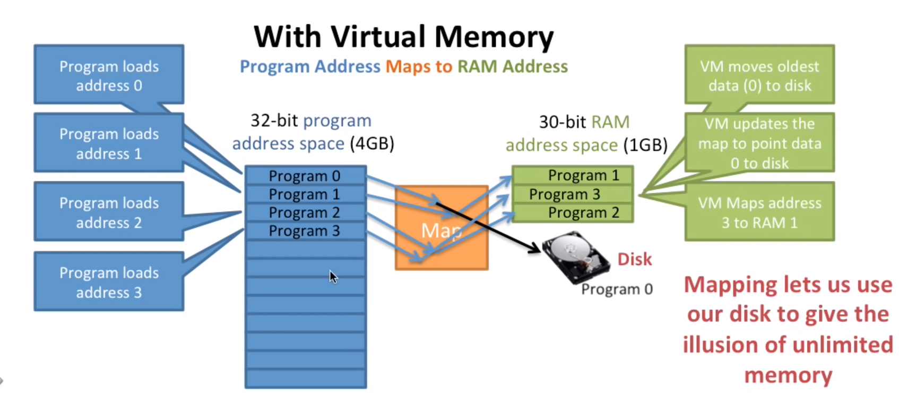
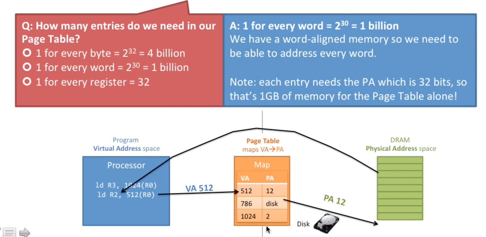
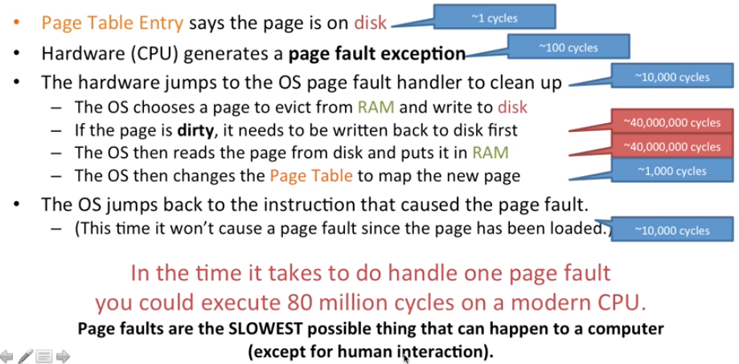
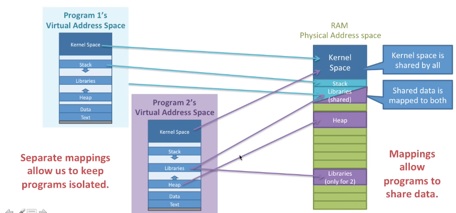
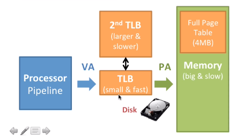
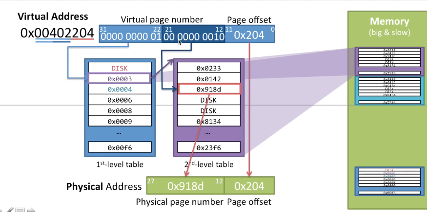
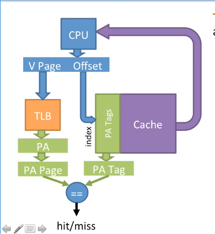

## 虚拟内存 

> 作者：[ScarboroughCoral](https://github.com/ScarboroughCoral)

如果你了解过一点虚拟内存的知识，这篇笔记可能会让你更深入的理解。

- 三个内存相关的问题
  - 没有足够的内存
  - 地址空间碎片化
  - 地址冲突
- 什么是虚拟内存
  - 中间件
  - 如何解决三个内存问题
  - 页表和转换
- 如何实现虚拟内存
  - 怎么让转换变得更快
- 虚拟内存和高速缓存Cache

### 三个内存相关的问题

- 没有足够的内存怎么办

MIPS提供给每个应用程序32位的地址空间，每个应用程序可以访问这32个地址空间中的任意一个字节。最早的MIPS架构是32位，最新的版本已经变成64位。也就是说你可以使用2^32bytes也就是4GB，这只是理论上，实际可能会缩小到2GB可用空间。

如果你的物理内存（内存条）是1GB该怎么办呢？就像下面这个图，可寻址空间大于实际物理内存大小。

- 程序如何分配内存（对于碎片内存）

就像下面这张图，首先内存加载程序p1和p2，开始3G空间被占用，剩余1G空间剩余，这时候p1退出，p3想使用内存，虽然还有2G剩余空间，但空间是碎片化的，这也是一个问题。这被称作**Memory fragmentation**`内存碎片化`。

- 如何保证进程安全（进程之间地址不相互访问）

就像下面这张图，两个程序同时访问`1024`这个地址的空间，内存中的信息会不会相互覆盖？

总结一下，如果所有程序都有相同的32位的寻址空间，那么可能导致以下问题：

- 如果实际物理能存大小小于4GB电脑可能会崩溃
- 如果运行多个程序可能会用光所有内存，这不是真正的用光而是碎片化的内存无法真正利用，这种碎片化依赖于我们不同程序的运行次序
- 不同的进程之间的数据可能会相互覆盖破坏，因为有相同的寻址地址

那么如何解决？

问题的关键在于**所有的程序有相同的寻址空间**，那么我们可不可以有属于自己的**虚拟内存**？如果可以的话，我们可以

- 将程序的内存空间和物理内存之间做一个映射（这使得我们使用物理内存RAM变的更加灵活）
- 当程序用光的时候，我们甚至可以将程序移动到硬盘

### 什么是虚拟内存

#### 中间件

虚拟内存是一层“中间组件”，虚拟内存的想法来自于一句话：

> Any problem in computer science can be solved by adding indirection.
> 任何计算机问题都可以通过添加一个中间件来解决。

如果没有虚拟内存这一层中间件，程序寻址空间将和实际物理内存相同。例如寻址空间大小大于实际RAM大小，如果你访问地址2024，得到的结果可能和访问地址24相同（因为地址越界最高位失效）。

*虚拟内存的作用就是将程序地址空间做一层映射映射到实际RAM地址。*

如下图所示：

#### 如何解决三个内存问题

- 没有足够的内存
  将一部分程序地址空间映射到硬盘，我们需要他的时候只需要将这一部分加载到内存中即可。内存中的暂时不使用的程序（比如Program0）可以将其放到硬盘中，这个过程叫做`Page Out`，即内存页换出，并更新映射，然后当新程序（P3）来了就可以映射到内存中原来旧程序（P0）部分。

- 碎片内存使用

这就是前面提到过的问题，如何充分利用程序退出后碎片化的内存？
有了前面提及的映射，这个就比较容易解决了，**我们可以将地址空间按照任意方式映射到实际物理内存RAM**

- 进程安全（进程之间不相互访问）

进程之间的内存如何能够独立、隔离（isolate）出来呢？例如同时访问`1024`的地址，两个程序如何能保证不是访问的实际物理内存中的同一个区域呢？

通过映射方式我们可以想出来，**只需要保证不同的程序映射到不同的地址空间就可以了。**

这样一来，因为每个程序都有自己的地址空间，那么他们不可能访问其他程序的数据，这非常的安全和可靠！

这也是有缺点的，当两个程序合作的时候，如何共享内存呢？**只需要将两个程序各自的地址空间拿出一部分映射到相同的RAM内存**。

#### 页表和转换

前面一直提到的映射就是页表的部分，页表所做的功能就是转换，`从VA（Virtual Address）虚拟地址转换为PA（Physical Address）物理地址`。每一个虚拟地址存储单位或者物理地址存储单位成为一个`页`。

那程序是如何访问内存的呢？

- 程序执行使用虚拟地址进行加载。
- 计算机将虚拟地址转换成物理地址
- （可选）如果转换过程中发现映射表中没有物理内存，那么操作系统就将它从硬盘加载到内存并修改映射表

- 计算机通过物理地址读取RAM并将数据返还给程序。

##### 页表

页表保存着VA虚拟地址到PA物理地址的映射方式。

下面一步一步说明页表的构建过程，从有问题的页表到一个臻于完美的页表，这可能是现代计算机操作系统所利用的机制。

既然页表保存着虚拟地址到物理地址的映射，那么页表就需要保存每一个虚拟地址到每一个物理地址的映射，我们称每一条记录为页表入口`Page Table Entry (PTE)`。如果是这样的话，那需要多大的页表？**结合下图：**如果是32位地址空间，每个字就需要1个PTE，这里一个字是32位，也就是4个字节，所以每4个大小也就是2位的地址空间就需要1个PTE，所以总共需要2^30个PTE。又因为每个PTE存储的是一个映射，由于虚拟地址是连续的可以只用偏移地址来表示，只需要存32位的物理地址，所以总共需要2^30x32b=4GB个大小。这说明1个4GB大小的RAM我们就需要拿出全部容量来存储页表，而且这没有考虑每个程序都需要一个页表。如果你没有明白这个计算公式，你仅需要知道如果这样构造页表所需容量太大，需要改造！

那么如何改造呢？以上情况的映射是1个字对应一个PTE页表入口，我们称这种情况为`细粒度映射`，那我们可不可以使用`粗粒度映射`呢？就像这个图一样：

这个图中，我们将每4Kb大小的地址空间做一个PTE，我们称之为`4KB Pages`，因为每个RAM按字节计量，或者你可以看为1K个字大小的页。这样我们就减少了映射也就是PTE的个数。这4KB大小的页映射的内部是连续的，如下图：

有了以上改进，我们有了更少的PTE映射个数，但是我们页降低了使用RAM的灵活性，因为我们每次需要移动一个页（4KB）。

现代计算机系统中，比较典型的就是4KB Pages（1024 words per page，每一页1024个字）。

##### 地址转换

我们需要将虚拟地址转换为物理地址。

假设我们使用的是4KB Pages，我们有32位虚拟地址，28位物理地址，如下图

那我们4KB大小的页内部没有做映射，这一部分如何映射呢？解决办法就是使用`偏移量offset`，如下图

我们将一个虚拟地址转换为物理地址，虚拟地址的pagenumber部分通过页表转换为实际物理地址的pagenumber部分，虚拟地址的offset部分直接作为物理地址的offset部分。

下面这个例子，32位虚拟地址，28位物理地址，4KB大小的页，所以需要12位offset。当虚拟地址为**0x00003204**的时候，将虚拟地址分为虚拟页编号（**0x00003**）、偏移量（**0x204**），offset直接使用，所以物理页内偏移量为**0x204**，虚拟页编号通过查页表，得到物理页编号为**0x0006**。所以得到的物理地址为**0x0006204**

当然，如果查页表的时候可能会产生`page fault`，即所需要的内容没有在RAM中，如图中的**0x00000**，这就需要发生中断，加载内容到RAM，然后修改页表，返回到内存上次执行的位置，这时候就会找到所对应的物理页编号了。

详细说一下当所需要的页不在内存中时会发生什么：

- 页表入口PTE告诉你所需要的页在硬盘中
- 硬件（CPU）生成一个Page Fault页错误
- 硬件跳到Page Fault Handler页错误处理程序来处理
  - 操作系统选择RAM中的一个页剔除写到硬盘中
  - 如果是需要读取的页是脏页，就需要先将其写回到硬盘再读取
  - 操作系统读取所需要的页到RAM
  - 操作系统修改页表的映射
- 操作系统跳转到发生页错误的地方开始执行（这一次就不会产生页错误了）

> 脏页是指页中的数据被改变了，如果没有改变，那就没必要写回到硬盘了。

> 脏页－linux内核中的概念，因为硬盘的读写速度远赶不上内存的速度，系统就把读写比较频繁的数据事先放到内存中，以提高读写速度，这就叫高速缓存，linux是以页作为高速缓存的单位，当进程修改了高速缓存里的数据时，该页就被内核标记为脏页，内核将会在合适的时间把脏页的数据写到磁盘中去，以保持高速缓存中的数据和磁盘中的数据是一致的。（来自百度百科）

那么页不在内存中时，这个过程需要多长时间呢？大约需要80 million 周期，这是采样自现代CPU，其中硬盘的读取占了大多数时间。***页错误可能是计算机中最慢的操作了。***

既然这么慢，那为什么还要用它呢？

优点：

- 你用光了内存计算机不会发生崩溃

缺点：

- 如果发生页错误会很慢

但是现代计算机还是使用内存页机制。如果你有非常大、足够大的RAM就不会发生页置换，这就是我们为什么认为内存越大计算机就变的越快的原因。

足够大的内存这是不可能的，不过一些现代操作系统不会发生页置换：

- IOS：如果你用了过多的内存，系统会杀死你的进程
- OS X 10.9：系统会先压缩你的程序，只有不得不置换的时候才会发生

> 这可能就是为什么在国内Apple比较受欢迎的原因吧，o(*￣︶￣*)o

每个程序都有自己的页表，我们可以把每个程序的虚拟地址映射到独一无二的内存中，这是为了程序之间不会没有预测的访问数据。

这说明每一个程序都有自己的32位虚拟地址空间，下面是Linux虚拟内存空间的使用情况。

1GB预留给linux内核作为内核区，栈区可以向下扩展到一个固定的最大值，Libraries区用于一些共享库的放置，堆区用于存储动态申请的内存向上扩展，接下来是data数据区用于存储静态变量，代码区用于放置程序编译之后的`二进制代码`。这之间有一些随机的偏移，这提高了安全性因为你不知道数据和代码区具体在哪儿。

这是一个具体的例子。

每个程序都有自己的虚拟地址空间，都有自己的页表映射方式保证了程序之间的隔离，因为不会随意相互访问内存，映射到内存的相同区域保证了程序之间的可合作性。

看一看实际如何使用独立的页表映射方式。这儿有两个程序，CPU都要执行这段指令`ld R2,2(R0)`，就是将内存地址2的数据加载到R2寄存器中，这里的内存地址是虚拟地址，因此需要通过查页表的方式来查询实际物理内存地址，然后取出数据。因为两个程序有不同的页表，执行指令时取得的虚拟地址2对应的物理地址一般不同或者相同（共享，这只需要将不同地址的虚拟地址映射到相同的RAM物理地址即可），因此最终访问的RAM地址也是不同的。CPU执行上下文切换切换进程时会将进程资源一起切换，这个切换就包含页表的切换。就像下面这张图。

### 如何实现虚拟内存

如何让虚拟内存有作用呢？因为虚拟内存使得内存使用更加灵活，但也有可能降低计算机系统的效率，我们只需要让虚拟内存机制达到尽可能大的效率即可。

虚拟内存的使用过程中需要做什么事情？

- 访问内存中的页表
- 通过查询页表将虚拟地址转换为物理地址
- 访问RAM相应物理内存中的数据

这个过程中访问了内存2次，访问内存有很多的工作要做，要了解到我们平均每条指令就需要访问1.33次内存（4/3，每三条指令访问4次内存），这部分显得很低效，这是优化的部分之一！

使用虚拟内存有优点，因为有“无限制”的程序和内存（每个程序都有地址空间，内存页可以换入换出），可以保护程序内存实现隔离，使用内存变得很灵活；但使用虚拟内存也会带来很昂贵的资源消耗，每个内存操作都需要查询页表，而且需要访问两次内存（1次页表访问、1次内存物理地址（访问RAM数据）访问）

#### 如何更快地完成虚拟地址到物理地址的转换

- TLB
  因为页表的访问是必须的，所以不可能减少这一部分工作。那我们可不可以通过软件来实现？我们知道这又增加了指令条数，也就增加了内存访问次数。那可不可以通过硬件来实现？添加一个缓存Cache。我们称这个`Page Table Cache`为`Translation Lookaside Buffer(TLB)`。他的工作机制如下图

最初，通过访问RAM中的页表来将虚拟地址转换为物理地址，这是非常慢的操作。

我们通过访问TLB缓存来获取虚拟地址对应的物理地址这是十分迅速的，因为访问速度比RAM快，这非常像一个Cache。如果想让TLB非常迅速，TLB就必须尽可能小。我们通常将TLB分离成指令页缓存（iTLB）和数据页缓存（dTLB），比如现代intel所生产的，每一页4KB，一共有64个页表入口PTE，或者是每一页2MB，32个PTE，都是4路关联（4路组关联，区别于全关联）

全部页表有1M个PTE，但是TLB里只有64个，这个差别很多大，这样访问页的时候如果在TLB里那就会变得很快。

- 页在RAM中
  - PTE在TLB
    - 最快
    - 1个周期用于地址转换，然后访问RAM或cache中的数据
  - PTE不在TLB
    - 较慢
    - 20-1000个周期从RAM中加载PTE到TLB，然后访问RAM数据
- 页不在RAM
  - PTE在TLB（几乎不可能，因为最近不经常使用的内存页被置换到硬盘，所以TLB在这段时间内也被置换了）
    - 很慢
    - 大约80M周期从硬盘加载到内存
  - PTE不在TLB
    - 比很慢还慢一点（o(*￣︶￣*)o）
    - 20-1000个周期地址转换，这时知道内存页在硬盘
    - 大约80M周期从硬盘加载到内存

TLB非常的小，怎么让TLB看着大一点，换句话说如何充分利用这么小的一个空间？

- 让每一页变的大一点。例如从64个4KB大小的页（共256KB数据）换为32个2MB大小的页（共64MB数据）
- 添加一个二级TLB，可能比一级TLB大一点，但是有一点慢。大多数二级TLB是一级TLB大小的八倍，当一级TLB的PTE没有命中的话就去二级TLB去查找加载到一级TLB

- 让硬件自动填充TLB（因为不会经过操作系统的处理）。这被称为`Hardware Page Table Walk`，由MMU来完成。

下面是如何通过TLB将虚拟地址转化为物理地址的例子。

CPU执行指令的时候，使用到了虚拟内存地址`0x00003204`，需要将虚拟地址转化为物理地址，首先去TLB查找缓存页表，这个例子中发现TLB中没有所要查找的页表入口PTE，然后就需要通过查找RAM中的页表中的PTE，找到了之后就需要将该PTE加载到TLB，然后将虚拟页编号映射到物理页编号（`0x00003->0x0006`），页内偏移直接使用，最终获取物理地址`0x0006204`。

下面再看一个PTE在TLB中的例子。

这个例子中CPU中使用虚拟地址`0x00003208`，首先通过虚拟页编号到TLB中去找，虚拟页编号`0x00003`，发现该页在TLB中，那就直接转化为物理地址。

下面又是一种情况，当所查找的页不在TLB中且TLB中满时需要做什么，**需要将TLB中选取一个PTE剔除以释放空间**

当所需要的页不在RAM中时会发生什么？CPU使用虚拟地址`0x00000860`，发现页编号`0x0000`不在TLB中，然后去RAM页表中查找，发现所需物理页在DISK中，然后就需要将DISK中数据加载到RAM中并更新RAM中的页表，然后将页表中对应的PTE加载到TLB中，将虚拟页号转换为物理页号获取物理地址。

- 多级页表

多级页表是使优化地址转换的另一方法。首先我们考虑一下页表的大小，虽然我们使用了4KB大小的页来减少页表中PTE中的数量，但对于32位大小的虚拟地址空间来说还是会有1M个PTE，每个PTE大约占4B（20位物理地址，还有其他的权限标志位等）。总共4MB。但是我们**每个程序都需要一个页表**，假设我们有**100**个程序在运行，那内存中就需要有400MB来维护各个程序的页表！还有一点，我们无法将页表换出到DISK硬盘中，因为我们需要通过页表来获取实际RAM物理地址，如果页表不在RAM中那我们就没有办法找到页表了（因为我们需要页表进行地址转换，其他设备的数据都是通过页表加载到内存并更新页表）。

那怎么解决这个问题呢？

我们虚拟内存的实现是通过添加一个中间件的思想实现的，那我们可不可以再添加更过的中间件来处理这个问题，答案是肯定的，使用`多级页表`。

下图是一个例子。

这个例子中使用了二级页表,一级页表中存了1024个4KB的页的PTE，每个PTE中物理页编号指向的是一个二级页表，这个页表对应存储的才是真正数据对应的物理页。对于每个程序，每个二级页表有1024个PTE，一共有1024个二级页表，那么有1024x1024个PTE，刚好就是1M个PTE，和未使用多级页表中的情况是一样的。

所以有了多级页表机制，我们可以把一级以下的页表换出到DISK硬盘中，因为我们可以通过一级页表来获取它，这也说明了一点我们必须要把一级页表存储在RAM中，就像下面这张图。

我们来思考一下，使用了多级页表，对于一个32位应用程序我们至少需要多大的内存空间来保存页表呢？`4KB+4KB`，因为使用了多级页表，一级页表必须存储在RAM中，因为一级页表只告诉我们二级页表的物理地址，所以我们还需要一个二级页表来获取实际的程序数据所在物理地址。一级页表有1024个PTE，每个PTE大约4B，所以一级页表是4KB，二级页表同样如此，所以总共为4KB+4KB，这比4MB好多了！

下面是一个二级页表使用的一个例子。

CPU使用到了虚拟地址`0x00402204`，那就需要将其转换为物理地址，转换过程中将虚拟地址分为两个部分：虚拟页号和页内偏移，虚拟页号又分为一级页表编号和二级页表编号。两级页表分别使用虚拟页号的一半（10位），对于虚拟地址0x00402204，一级页表编号N1是`0000 0000 01`，二级页表编号N2是`00 0000 0010`，首先使用N1查询RAM中的一级页表得到二级页表的物理页地址（一个页刚好是4KB，二级页表的大小），如果页不在RAM中就需要将它加载到RAM中并更新一级页表，然后使用N2查询二级表获取实际数据的物理页地址，如果实际数据的内存页不在RAM中就需要加载到RAM中并更新二级页表，最终通过物理页地址和虚拟地址的页内偏移得到了最终的物理地址。

小结一下：

- 每个运行的程序需要一个一级页表存储在RAM中，这样可以获取低级的页表以获取实际数据的物理页。
- 需要一个二级页表存储在RAM中，这样我们可以翻译程序的某些地址，随时切换。
- 使用两级页表共同完成地址`VA->PA`的转换
- 高10位地址用于索引一级页表的PTE
- 接下来的10位用于索引二级页表的PTE
- 我们可以置换页表中的一部分到DISK硬盘中

### 虚拟内存和高速缓存Cache

这一部分讨论有关TLB转译后备缓冲区和高速缓存Cache的交互问题。

我们通常有两种方式来将TLB和Cache来交互：

- 物理缓存（`Physical Cache`），Cache使用物理地址（比较慢，访问cache之前必须做一次TLB地址转换，假设TLB转换需要1个周期、物理地址读取Cache需要1个周期）

- 虚拟缓存（`Virtual Cache`），Cache使用虚拟地址直接获取缓存数据（很快，1个周期），不必进行地址转换，如果Cache没有命中才会发生地址转换。

对于虚拟缓存来说，两个程序不能共享虚拟缓存，因为虚拟缓存使用的是虚拟地址，虚拟内存的程序隔离机制无法起作用（因为地址没有转换），这也是虚拟缓存的一个问题。我们也可以简单地解决这个问题，方法就是不仅仅使用虚拟地址，再添加一个标志位用于区分是哪一个应用程序（比如PID）。

有没有两全其美的方法，访问Cache的同时访问TLB，仍然可以使用虚拟内存的隔离机制。

- 还是使用虚拟地址**VA**访问Cache，cache数据记录中有一个物理标志**PTag**，同时通过TLB将虚拟地址**VA**转换为物理地址**PA**
- 通过物理标志**PTag（缓存数据所在的RAM物理地址）**和TLB获取的物理地址**PA**比较是不是命中

这只是想法，具体实现还是有些差别，下面一步步说明。

这种访问我们称之为`虚索引实标签缓存（Virtually Indexed,Physically Tagged）`，这是当今处理器中最常用的一级缓存。

> 这种缓存利用了页面技术的一个特征，即虚拟地址和物理地址享有相同的页内偏移值（page offset）。(Wikipedia)

- Cache通过页内偏移（虚拟和物理是相通的）索引
- 用物理页面号做标志

这样我们既实现了使用虚拟地址访问Cache（快速，不用地址转换），又实现了虚拟内存隔离保护机制（物理地址做标志）。

> 这种技术的一个缺点是，在使用直接匹配缓存的前提下，缓存大小不能超过页面大小，否则页面偏移范围就不足以覆盖缓存索引范围。这个弊端可以通过提高组相联路数来改善。(Wikipedia)**（待完善）**

总结一下：

- TLB地址转换和查询Cache同时进行
  - 使用虚拟页号进行地址TLB转换
  - 使用虚拟地址偏移量进行cache索引
  - 通过TLB获取了物理页号
  - 通过Cache获取了物理标志（物理页号）
- TLB转换得到的物理页号和物理标志`PA Tag`相等说明缓存命中。

这种方式快速的原因是地址转换和cache索引同时进行，安全的原因是Cache只有在物理地址匹配的情况下才会命中。

### 总结

***以上便是对虚拟内存的学习和总结，可能还有一些地方会有错误或者知识点漏洞，希望读者可以热情的提出[issue](https://github.com/ScarboroughCoral/OS-Notes/issues/new)。如果还有不理解的地方可以查阅文章末尾我所参考的一些资料，谢谢阅读！***

### 参考资料

#### 引用作品

- David Black-Schaffer.(2014).[Virtual Memory](https://www.youtube.com/watch?v=qcBIvnQt0Bw&index=1&list=PLiwt1iVUib9s2Uo5BeYmwkDFUh70fJPxX)

#### 引用文献

- Aniruddha-Tapas.(2014).[Operating Systems Notes](https://github.com/Aniruddha-Tapas/Operating-Systems-Notes)
- wikipedia.(2018).[CPU Cache](https://zh.wikipedia.org/wiki/CPU%E7%BC%93%E5%AD%98)

#### 参阅书目
